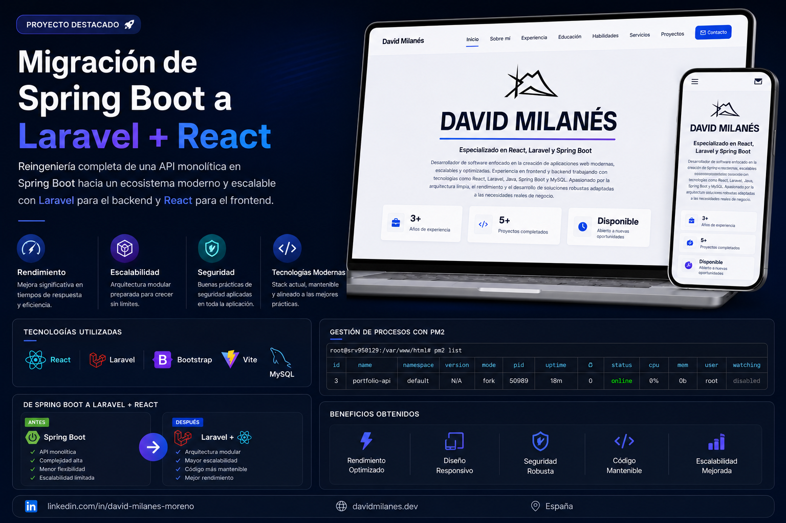

<p align="center">
  
</p>

<h1 align="center">🚀 Portfolio Full Stack - Laravel + React</h1>

<p align="center">
Portfolio profesional desarrollado con Laravel 12, React, Vite, Bootstrap y MySQL.
</p>

<p align="center">


</p>

---

# 🌐 Demo

👉 https://dmilanes.es

---

# 📖 Descripción

Portfolio profesional desarrollado para mostrar experiencia, proyectos, formación académica y habilidades técnicas.

La aplicación está construida mediante una arquitectura moderna basada en:

- Laravel 12
- React
- Vite
- Bootstrap 5
- MySQL

---

# 🛠️ Tecnologías

## Backend

- Laravel 12
- PHP 8.3+
- MySQL
- API REST

## Frontend

- React
- Vite
- Bootstrap 5
- Axios

---

# ⚙️ Requisitos

Antes de comenzar asegúrate de tener instalado:

- PHP 8.3 o superior
- Composer
- Node.js 20 o superior
- npm
- MySQL 8

---

# 🚀 Instalación Local

## 1. Clonar el repositorio

```bash
git clone https://github.com/tu-usuario/tu-repositorio.git

cd tu-repositorio
```

---

## 2. Instalar dependencias Laravel

```bash
composer install
```

---

## 3. Crear archivo .env

```bash
cp .env.example .env
```

---

## 4. Generar clave

```bash
php artisan key:generate
```

---

## 5. Configurar base de datos

Editar el archivo `.env`

```env
DB_CONNECTION=mysql
DB_HOST=127.0.0.1
DB_PORT=3306
DB_DATABASE=portfolio
DB_USERNAME=root
DB_PASSWORD=
```

---

## 6. Ejecutar migraciones

```bash
php artisan migrate
```

---

## 7. Crear enlace de almacenamiento

```bash
php artisan storage:link
```

---

## 8. Iniciar Laravel

```bash
php artisan serve
```

Servidor:

```text
http://127.0.0.1:8000
```

---

# ⚛️ Configuración React

Entrar en la carpeta del frontend:

```bash
cd portfolio-front-react
```

Instalar dependencias:

```bash
npm install
```

Crear archivo `.env`

```env
VITE_API_URL=http://127.0.0.1:8000/api
```

Iniciar React:

```bash
npm run dev
```

Servidor:

```text
http://localhost:5173
```

---

# 📦 Compilar Producción

```bash
npm run build
```

La compilación se generará en:

```text
dist/
```

---

# 📂 Estructura

```text
portfolio/
│
├── app/
├── bootstrap/
├── config/
├── database/
├── public/
├── resources/
├── routes/
├── storage/
│
├── portfolio-front-react/
│   ├── src/
│   ├── public/
│   └── dist/
│
├── docs/
│   └── portfolio-cover.png
│
└── README.md
```

---

# 👨‍💻 Autor

## David Milanés Moreno

🌐 https://dmilanes.es

📍 Murcia, España

💼 Full Stack Developer

---

# ⭐ Apóyame

Si te ha gustado el proyecto:

⭐ Dale una estrella al repositorio.
